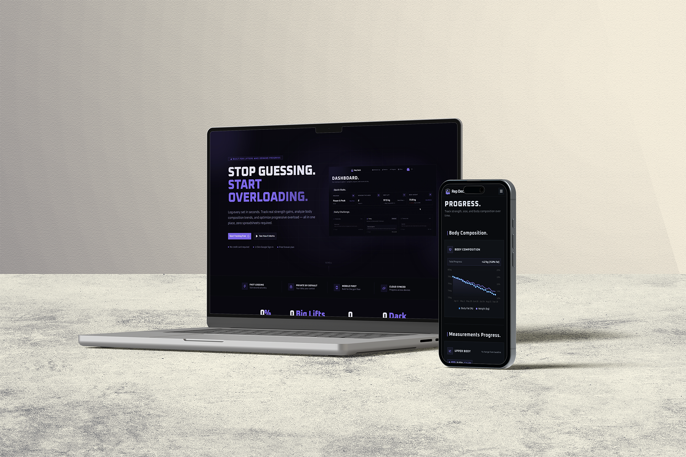

# Rep Deck 🏋️

Rep Deck is a high-performance strength-training tracker built for lifters who focus on raw progression — load, volume, intensity, and consistency. Log every set, maintain versioned training plans, monitor body composition metrics, and track estimated 1RM trends across time. Designed for fast interaction on the gym floor, not clunky spreadsheets.

---



**Live Demo:** [](https://rep-deck.vercel.app)

---

## Key Features ✨

- **Workout Logging**: Automatic target pre-filling based on active routine templates. Record weight, reps, and RPE set-by-set with previous session context rendered inline for targeted overload.
- **Versioned Programs**: Create modular program templates with day and exercise schedules. Version templates (v1, v2, v3…) and iterate training cycles without overwriting historical workout data.
- **Progress Analytics**: Interactive charts powered by Recharts for estimated 1RM trends across primary compound lifts (Squat, Bench, Deadlift, Overhead Press), session volume, muscle group frequency, and body composition.
- **Body Metrics**: Record bodyweight, body fat percentage, and six standard tape measurements. Includes built-in unit conversion and data quality scoring to flag inconsistent logging intervals.
- **Automated PR Tracking**: Live estimated 1RM calculation flags personal records during session entry, rendering inline badges and session-end PR summaries.
- **Inline Performance History**: View all-time PRs and last-session performances directly within the set-logging view.
- **8 Dark UI Themes**: Hand-crafted high-contrast dark themes (including Rose Pine, Violate Eye, and flat aesthetic schemes) with instant persistent switching.

---

## Tech Stack 🛠️

[](#)
[](#)
[](#)
[](#)
[](#)
[](#)
[](#)
[](#)
[](#)
[](#)
[](#)

### Core Framework & Runtime

- [](#) — React framework utilizing App Router and Server Actions.
- [](#) — Modern UI rendering with React Compiler optimization.
- [](#) — End-to-end type safety.

### Database & Auth

- [](#) — Type-safe SQL schema design and query execution.
- [](#) — Direct driver integration via `postgres`.
- [](#) — Managed DB hosting and OAuth authentication via `@supabase/ssr`.

### UI & Styling

- [](#) — CSS-first configuration via PostCSS and `@theme` directives.
- [](#) — Low-level accessible primitives (`@base-ui/react`) styled via Class Variance Authority (`cva`) and standard Tailwind primitives.
- [](#) — Declarative visualization for strength and body metric metrics.
- [](#) — Modular icon set via `@phosphor-icons/react`.

### Tooling

- [](#) — Fast single-tool linting and code formatting.
- [](#) / [](#) — Package management and script execution.

---

## Architecture & Design Patterns 🏗️

```plaintext
rep-deck/
├── src/
│   ├── app/                    # Next.js App Router
│   │   ├── (extra)/            # Public pages (privacy, terms)
│   │   └── (user)/             # Authenticated app routes (dashboard, workout-log, etc.)
│   ├── actions/                # Server actions (auth, workout logging, metrics, plans)
│   ├── assets/                 # Static assets and media resources
│   ├── components/             # Reusable UI components & primitives
│   │   └── ui/                 # Base UI & design system primitives
│   ├── db/                     # Drizzle ORM configuration and database access
│   │   └── schema/             # Drizzle database schemas
│   ├── hooks/                  # Custom React hooks
│   ├── lib/                    # Shared context providers and utilities
│   ├── types/                  # TypeScript interface and type definitions
│   ├── utils/                  # Helper functions and utilities
│   └── proxy.ts                # Request context and proxy configuration
├── drizzle.config.ts           # Drizzle ORM migration and connection settings
├── biome.json                  # Biome linter and formatter configuration
├── next.config.ts              # Next.js configuration settings
└── package.json                # Project dependencies and script declarations
```

### Key Engineering Decisions

1. **Immutable Training History (Versioned Programs)**
   Editing a program template creates a new version step (v1 → v2). Completed workout logs retain a foreign key reference to the exact program version under which they were performed, preventing past workout data from mutating when workout plans are updated.

2. **Estimated 1RM Engine**
   Strength PRs are evaluated dynamically per set using the standard Epley formula:

   $$
        \text{Estimated 1RM} = \text{Weight} \times \left( 1 + \frac{\text{Reps}}{30} \right)
        $$

    New peak values are stored at the set level and surfaced in real-time.

3. **Global Unit Normalization**
   Data integrity is maintained by storing all weight values in kilograms (kg) and measurements in inches (in) within Postgres. The `UnitProvider` handles real-time conversions at the client view layer according to user preferences (kg/lb, cm/in).

4. **Zero-Radius CSS Variable Theming**
   Themes rely on strict CSS custom properties attached to `html[data-theme]`. All 8 visual themes force `--radius: 0` to preserve the flat, brutalist UI identity across components.

---

## Getting Started 🏁

### Prerequisites

- [](#) — `v20.0.0` or higher
- [](#) or [](#) — Package manager
- [](#) — Instance via [](#) or local installation

### Installation

1. **Clone repository**

    ```bash
    git clone https://github.com/rudra-xi/rep-deck.git
    cd rep-deck
    ```

2. **Install dependencies**

    ```bash
    bun install
    # or
    npm install
    ```

3. **Configure Environment Variables**

    Create a `.env.local` or `.env` file in the root directory:

    ```env
    # Database Connections
    DATABASE_URL="postgresql://postgres.<project-ref>:<password>@aws-0-<region>.pooler.supabase.com:6543/postgres?sslmode=require"
    DIRECT_URL="postgresql://postgres.<project-ref>:<password>@aws-0-<region>.pooler.supabase.com:5432/postgres?sslmode=require"

    # Supabase Setup
    NEXT_PUBLIC_SUPABASE_URL="https://<project-ref>.supabase.co"
    NEXT_PUBLIC_SUPABASE_ANON_KEY="<your-anon-key>"

    # Application Domain
    NEXT_PUBLIC_APP_URL="http://localhost:3000"
    ```

4. **Initialize Database Schema**

    ```bash
    # Push schema definitions to database
    bunx drizzle-kit push

    # (Optional) Populate database with sample development data
	bun src/db/seed.ts
    ```

5. **Run Development Server**

    ```bash
    bun run dev
    ```

    Navigate to [http://localhost:3000](http://localhost:3000).

---

## Scripts & Commands 📜

| Script     | Command             | Description                                    |
| :--------- | :------------------ | :--------------------------------------------- |
| **Dev**    | `npm run dev`       | Launches Next.js dev server with hot reloading |
| **Build**  | `npm run build`     | Compiles production bundle with React Compiler |
| **Start**  | `npm run start`     | Runs production built server                   |
| **Lint**   | `npm run lint`      | Runs Biome code checks                         |
| **Format** | `npm run format`    | Auto-formats code via Biome                    |
| **Fix**    | `npm run check:fix` | Performs automated lint fixes and formatting   |

---

## Author & License 🪪

Developed by **rudra-xi**.

- [](https://github.com/rudra-xi)
- [](https://www.linkedin.com/in/goutam-rudraxi)

Distributed under the [](#). Read [`LICENSE.md`](./LICENSE.md) for details.
